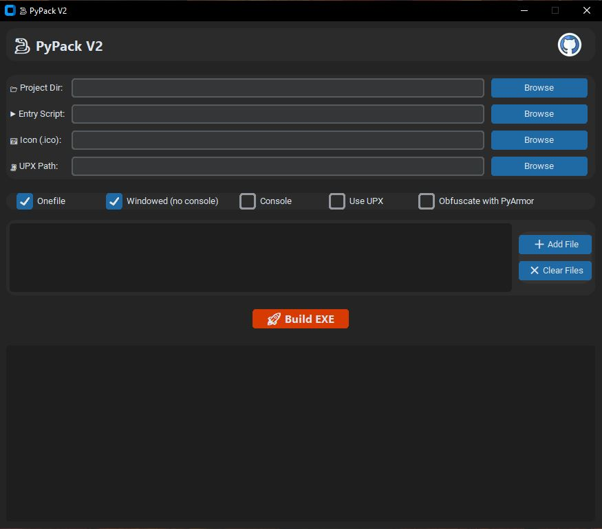

# 🐍 PyPack V2


**PyPack V2** is an upgraded GUI tool for building Python executables using **PyInstaller**, with optional **PyArmor** obfuscation. Version 2 features a modern, dark-themed interface with **CustomTkinter**, GitHub integration, UPX path support, and improved import detection.

---

## 🚀 Features

* **Project Configuration**:

  * Select project directory, main Python script, and icon (.ico) file.
  * Specify UPX path for compression.
  * Add additional data files (e.g., JSON, images).
* **PyInstaller Options**:

  * **Onefile**: Create a single executable file.
  * **Windowed**: Build a GUI application without a console.
  * **Console**: Include a console for debugging output.
  * **UPX Compression**: Use UPX with specified path or system PATH.
* **PyArmor Obfuscation**: Optional code protection.
* **Live Log Window**: Real-time monitoring of build progress.
* **Modern GUI**: Built with **CustomTkinter** for dark mode and improved user experience.
* **Enhanced Import Detection**: Accurate scanning using `modulefinder`.
* **Missing Module Warnings**: Detect missing packages and suggest installation.

---

## 🖥️ Screenshots



---

## 🛠 Prerequisites

* **Python**: Version 3.7 or higher.
* **Required Packages**: Listed in `requirements.txt`.
* **Optional**: PyArmor (for obfuscation).
* **Optional**: UPX (for compression).

---

## 📥 Installation

1. Clone the repository:

   ```bash
   git clone https://github.com/Arianlavi/PyPack.git
   cd PyPack
   ```
2. Install dependencies:

   ```bash
   pip install -r requirements.txt
   ```
3. Run the application:

   ```bash
   python pypack.py
   ```

---

## 🖥 Usage

1. Launch the application:

   ```bash
   python pypack.py
   ```
2. Configure your project:

   * **Project Directory**: Folder containing your Python project.
   * **Entry Script**: Main `.py` file.
   * **Icon File**: Optional `.ico` file.
   * **UPX Path**: Optional path if using UPX compression.
   * **Build Options**:

     * [x] Onefile
     * [x] Windowed (GUI only)
     * [x] Console
     * [x] Use UPX
     * [x] Obfuscate with PyArmor
   * **Additional Data Files**: Add JSON, images, or other resources.
3. Click **Build EXE** to start the build process.
4. Monitor progress in the **log window**.
5. Find the executable in the `dist/` folder.

---

## 📦 Requirements

Key packages:

* `pyinstaller`
* `pyarmor` (optional)
* `customtkinter` (GUI)
* `Pillow` (for images/icons)

Full list in `requirements.txt`.

---

## Support & Donations

If PyPack V2 helps you, consider supporting the project! Your contributions improve features and maintain the project.

| Cryptocurrency            | Address                                        | Network |
| ------------------------- | ---------------------------------------------- | ------- |
| **Bitcoin (BTC)**         | `bc1q3r79a2t3tuada56zv722ykrwjadgsh79m5pthz`   | Bitcoin |
| **Ethereum (ETH) / USDT** | `0x66D74F4b7527ea9eD5BA5e2E02fa93fB7a90325d`   | ERC-20  |
| **Solana (SOL)**          | `9irdHFdeWVb6cnu8HTdKAs3Lg1PD8HiQQLhVHLSAQq6X` | Solana  |

**Important**:

* Verify addresses before sending.
* Donations are non-refundable.
* Use trusted wallets like [Exodus](https://exodus.com) or [Trust Wallet](https://trustwallet.com).

---

### Other Ways to Support

* Give the project a ⭐ on GitHub.
* Share PyPack V2 on social media.
* Contribute via pull requests or issue reports.

---

## ⚠️ Disclaimer

* Use responsibly; only for personal projects.
* Do not use for illegal purposes.
* Misuse may result in software restrictions.

---

## 💡 Contributing

* Fork the repository
* Create a new branch
* Submit a pull request

---

## 📄 License

Licensed under the MIT License. See [LICENSE](LICENSE) file for details.

---

## 📬 Contact

Created by **Arian Lavi**

* GitHub: [ArianLavi](https://github.com/arianlavi)
* Telegram: [@Arianlavi](https://t.me/Arianlvi)
